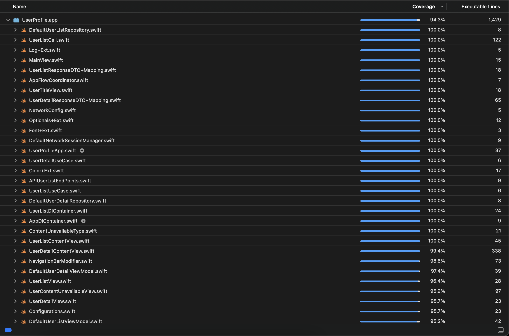

# User Profile

The user profile app features a user-friendly interface for exploring user details. It offers essential features for both browsing the list of available users and viewing detailed information about each selected user.

### User List
- Our user list provides a quick and easy way to find the information you need.  Simply browse our comprehensive user directory and view essential details like name, email, and profile picture at a glance.


### User Detail
- Dive deeper and explore a user's complete profile!  Access in-depth information including name, role, contact details (email, phone), and background information like blood group, address, company, and even crypto holdings (if applicable)
## Key Features

- Clean Architecture with MVVM, DI and Coordinator pattern
- SwiftUI + Combine
- Unit Test cases (89.6% Code-Coverage)
- Designed for scalability
- Modular code


## API Reference

This app utilizes public user APIs. You can find the API details by following this link:

Website: https://dummyjson.com/docs/users

#### Get all users

```http
  GET /users
```

#### Get user

```http
  GET /users/${id}
```

| Parameter | Type     | Description                       |
| :-------- | :------- | :-------------------------------- |
| `id`      | `string` | **Required**. Id of User ID to fetch |


## Screenshots

### App Icon

<p align="left"><strong>App Icon & Launch Screen</strong></p>

<p align="left">
  
  
</p>

<p align="left"><strong>User List Screen</strong></p>

<p align="left">
  
</p>


<p align="left"><strong>User Detail Screen</strong></p>

<p align="left">
  
</p>


<p align="left"><strong>Loading Screen</strong></p>

<p align="left">
  
  
</p>

<p align="left"><strong>Content Unavailable Screen</strong></p>

<p align="left">
  
  
</p>


## Code Coverage Screenshot

| Code Coverage                                |
| -------------------------------------- |
|  |
